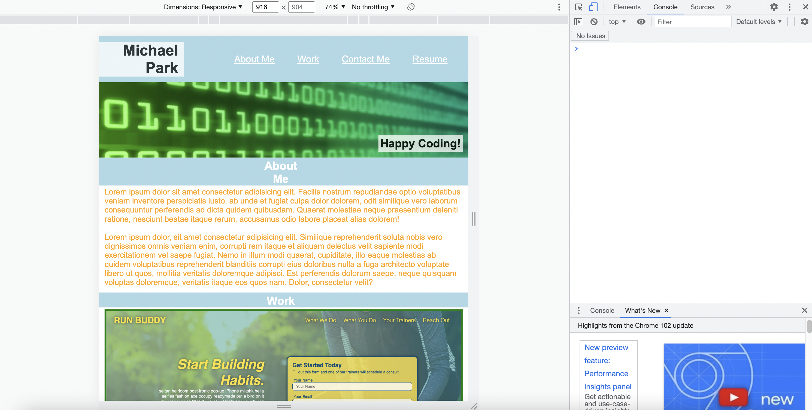

# portfolio-hw2

This application is a mock up page of a developer's portfolio.  We will come back later to add more projects to this portfolio.  

- when images of projects are hovered over, opacity and border color change
- when screen size changes to 980px, colors and layout of the page change
- all links in nav bar and imgs are working
- nav links change color when hovered

deployed application: https://tjp4ca.github.io/portfolio-hw2/
github repository : https://github.com/tjp4ca/portfolio-hw2

